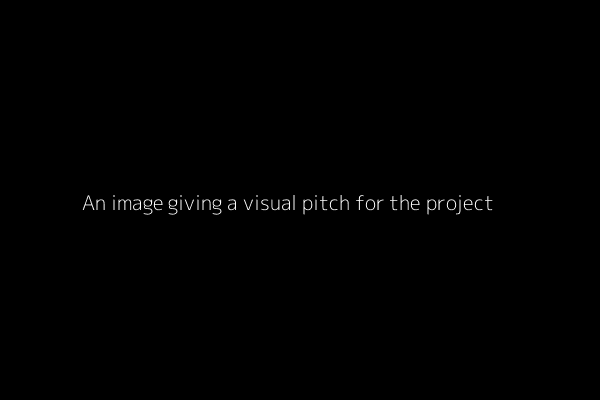

<div align="center">

# Python Template
[](https://www.python.org/)
[](https://github.com/miguelbper/python-template/actions/workflows/code-quality.yaml)
[](https://github.com/miguelbper/python-template/actions/workflows/tests.yaml)
[](https://codecov.io/gh/miguelbper/python-template)
[](LICENSE)

Template for python projects, using modern tooling and practices

</div>

---

## Description
A template for python projects, using:
- **[uv](https://docs.astral.sh/uv/)**: A fast Python package installer and resolver
- **[just](https://github.com/casey/just)**: A command runner that makes it easy to run project-specific commands
- **[direnv](https://direnv.net/)**: Automatically loads and unloads environment variables based on the current directory
- **[pre-commit](https://pre-commit.com/)**: Git hooks to ensure code quality before commits
- **[ruff](https://docs.astral.sh/ruff/)**: A fast Python linter and formatter
- **[pyright](https://github.com/microsoft/pyright)**: Static type checker for Python
- **[pytest](https://docs.pytest.org/)**: Testing framework
- **CI/CD**: GitHub Actions workflows for testing, code quality, and publishing
- **Version Management**: Automatic version management using git tags


## Project Structure
```shell
.
├── .github
│   └── workflows
│       ├── code-quality.yaml  # Runs linting and type checking
│       ├── coverage.yaml      # Reports test coverage to Codecov
│       ├── publish.yaml       # Whenever there is a new tag, publishes the package to GitHub / PyPi
│       └── tests.yaml         # Runs the test suite
│
├── src
│   └── python_template        # Main package source code
│       ├── __init__.py
│       └── main.py            # Example script
│
├── tests
│   ├── __init__.py
│   └── test_main.py           # Example tests script
│
├── .envrc.example             # Rename to .envrc and include your environment variables here
├── .gitignore
├── .pre-commit-config.yaml    # Configuration for pre-commit hooks
├── .python-version            # Pinned Python version for the project
├── justfile                   # Command runner for project tasks
├── LICENSE
├── project-image.png
├── pyproject.toml             # Python project configuration and dependencies
├── README.md
└── uv.lock                    # Lock file for Python dependencies
```

## Installation
For all functionalities in this template to work, you need to install the suggested tooling: [uv](https://docs.astral.sh/uv/), [just](https://github.com/casey/just) and [direnv](https://direnv.net/). See each individual webpage for installation instructions.


## Usage
- Click on [<kbd>Use this template</kbd>](https://github.com/miguelbper/python-template/generate) to create a new repository
- Run `just` in the terminal to view the available project commands, together with a description
- Run `just setup` in the terminal to setup the project. This is equivalent to running the following commands in the shell:
```shell
# Allow direnv to load environment variables
direnv allow

# Create virtual environment and install dependencies
uv sync

# Install pre-commit hooks
uv run pre-commit install
```
- Setup any environment variables you may need by adding them to `.envrc`.

## License
This project is licensed under the MIT License - see the [LICENSE](LICENSE) file for details.

## Acknowledgements
Some links that were very informative to me when learning about modern python practices were
- https://drivendata.co/blog/python-packaging-2023
- https://rdrn.me/postmodern-python/

---
*Template for your project's `README.md`. Delete text above this line, and edit the code below.*

<div align="center">

# Project Title
[](https://www.python.org/)
[](https://github.com/miguelbper/python-template/actions/workflows/code-quality.yaml)
[](https://github.com/miguelbper/python-template/actions/workflows/tests.yaml)
[](https://codecov.io/gh/miguelbper/python-template)
[](LICENSE)

*A brief description of what this project does and who it's for.*



</div>

---

## Description
*Provide a more detailed explanation about your project here. You can include:*
- *What problem does it solve?*
- *What technologies are used?*
- *What are the key features?*

## Installation
*Provide installation instructions. Write out the commands the user should use to use your project.*

## Usage
- *Explain how to use your project. Include code examples.*
- *You can also include screenshots or GIFs here to demonstrate usage.*

## License
This project is licensed under the MIT License - see the [LICENSE](LICENSE) file for details.

## Acknowledgements
- *List any resources, libraries, or tools that you used or were inspired by*
- *Credit any collaborators or contributors*
- *Link to any relevant documentation or articles*

## More badges
[](https://www.gnu.org/software/bash/)
[](https://git-scm.com/)
[](https://numpy.org/)
[](https://pandas.pydata.org/)
[](https://seaborn.pydata.org/)
[](https://scipy.org/)
[](https://www.sympy.org/)
[](https://scikit-learn.org/)
[](https://pytorch.org/)
[](https://lightning.ai/docs/pytorch/stable/)
[](https://hydra.cc/)
[](https://github.com/astral-sh/ruff)
[](https://github.com/astral-sh/uv)
